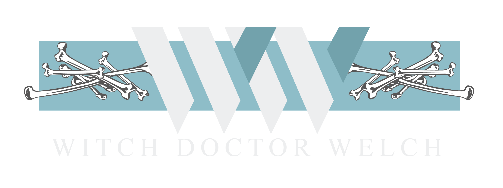
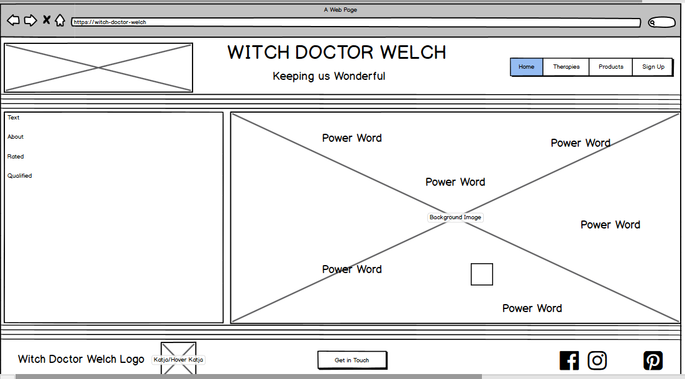
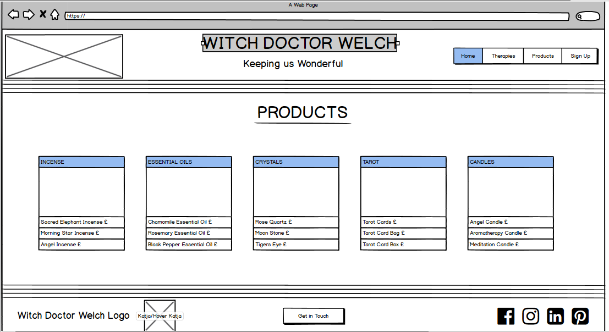
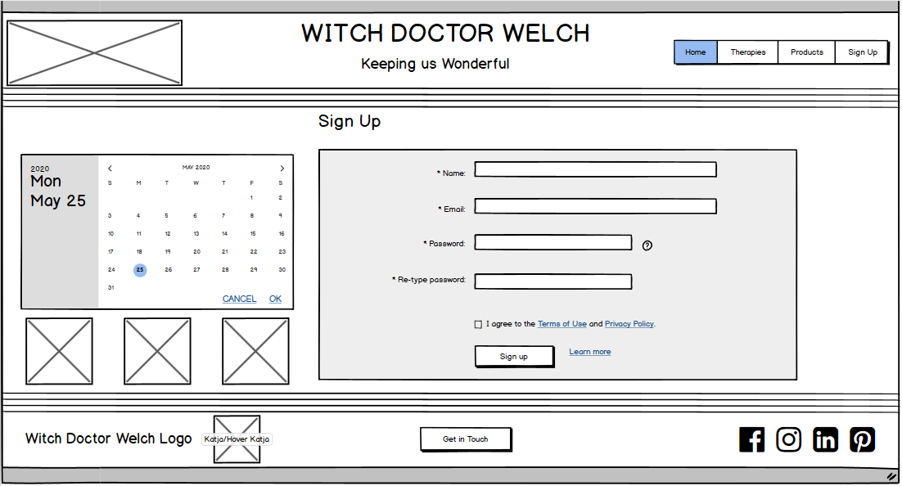
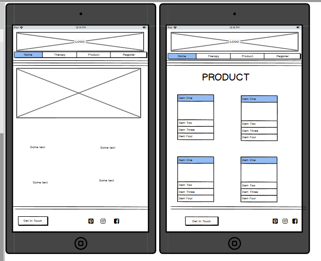
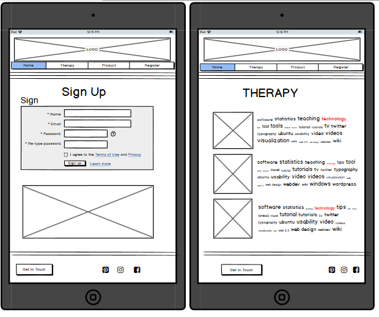
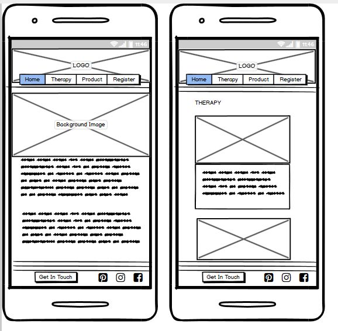
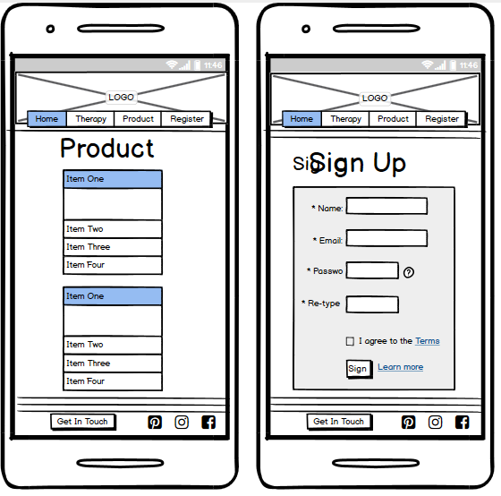
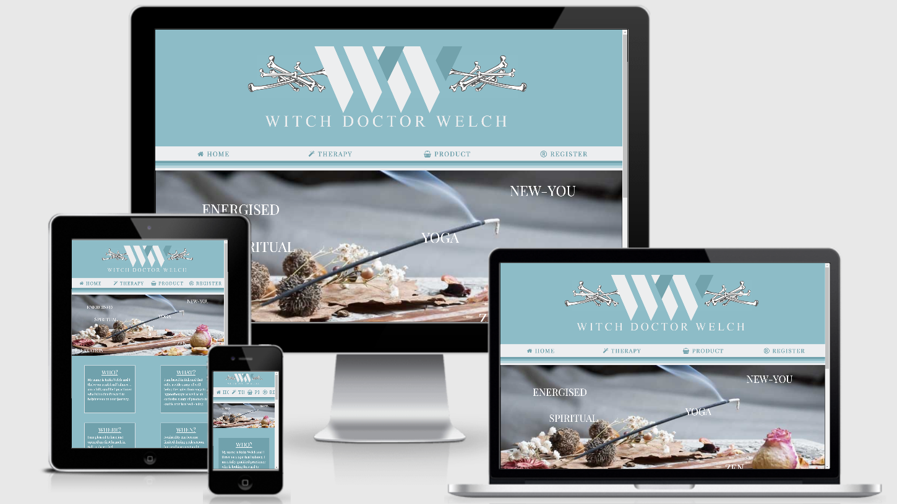

# MileStone Project One- Witch Doctor Welch

A front end static website made for Katja Welch. A website where we can display a bit about Katja and what therapies
she can offer being a fully trained practioner and showcase to the world. Katja is also a believer in usualy sustainably
sourced products which will be displayed on the website. 
 
# Table of Contents

**[UX](#UX)** 
**[Features](#Features)** 
**[Technologies Used](#Technologies-used)** 
**[Testing](#Testing)** 
**[Deployment](#Deployment)** 
**[Credits](#Credits)** 
**[Acknowledgement](#Acknowledgement)** 

## UX
 
The website will be designed to showcase the wonderful work of Katja Welch, with the use of a calming color palette
and well thought of images and style it will show nicely and attratc more people to find out more and enquire more. 

### User Stories
--
1. As a potential client I want to know all about what is on offer with an informative site that is pleasing
to the eye.
2. As an owner I want to point out the information on hand to entice future business with professionalism and
showcase why am I better than the person next door.
3. As a buyer I want to know what I am investing my money in and know its sustainable.
4. As a member of the public I want to be gripped at something I wouldn't normally think twice about.
5. As a person who doesn't have access to a computer I want to be able to veiw the website with the Content
and design that is pleasing to the eye.

### Wireframes
In order to prep for my project I used Balsamiq Wireframes to do muck ups for all screen sizes for all 4 pages as seen in the
images below.
#### DESKTOP

#### MEDIUM DEVICE 

#### MOBILE 

### Color scheme
I chose a calming  color scheme which is reflected all through my project, below is 
an image of colors used. Codes are #70A1AC, #8DBCC7, BAD6DD, #EDEEF0

### Typogrophy
Using google fonts i decided to use two fonts although one is purely for the clipart on the 
register page for a bit of fun. The fonts used are below from Google Fonts.
* Playfair display
* Pangolin

## Features

My project has a four page structure, index.html(the home page), therapy.html(Therapy Page), product.html(Product Page)
and register.html(Register Page). Designed to be easily navigated and ensure a flow as to not confuse the user, all Pages
have the same header and footer. The header includes the brand logo full screen banner which fits nicely with the site. 
The footer includes "get in touch button" that takes you to the register.html page and social media links that when hovered 
are styled to fit in with the page color scheme.

### Home Page
The home page was designed to be the most entising and want the user to want to know more. We have the who, what, where
and why to so the user knows what they are looking at and why they have found this page. Above the 4 w's is an image with
power words that transition over at different times to make it more engaging for the user.
 
### Therapy Page
The next page is the Therapy page. This page is eye catching and shows the details about the different therapies that
are on offer and shows the price per session and length. This allows the user to get a feel for what they could sign up for.
There are images to enhance the feel of the site.

### Product Page
The Product page show cases all items that the owner has sustainably sourced and offeres to the users. Each product has
a hoverable image with a description of the type of product and hoverable rows with the type and price of what is for sale.
There is a more info button under each image to ensure the user clicks(for mobiles the click action gets the hover effect).
Again images are supplied so the user is not confused and gets a feel for the items for sale.

### Register Page
All users at this point are here and here for a reason. On this page I have implented a little checklist clipboard with an arrow
image pointing to the form. It's a playful part that adds the element of fun. Then we have the sign up form which is validated
to ensure it gets filled in.

## Features Left to Implement
Below is a list of features left to implement(When my knowledge is a bit broader)
* When the submit form is clicked on I would like a success message to appear and the information to be sent to the business.
* To implement the product page to be a button to click on for more information instead of a hover overlay.
* To get the twirly arrow on the register page to bounce and twirl into the page. :)

## Technologies Used
Below is a list of all technologies used in order to achieve the end goal.

#### Languages
* HTML -A standard markup language used for the content of my webpage
* CSS - A style sheet language used for the design of the web page
#### Frameworks
* Bootstrap [https://v4-alpha.getbootstrap.com/]- Used for layout of my web page and for styling as well.
#### Libraries
* Google Fonts [https://fonts.google.com/]
* Font Awesome(Bootstrap Library) [https://www.bootstrapcdn.com/fontawesome/]
* Bootstrap Jquery and Popover for my form on register.html [https://getbootstrap.com/docs/3.3/javascript/]
* W3 Schools [https://www.w3schools.com/] a great base to get refresher materialswhen help was needed.
* Youtube [https://www.youtube.com/] for some tutorials when things where tough

## Testing 
Throughout the project I was testing as I made it on an open webpage through gitpod to see realtime changes. I used
the chrome developer tools to check the responsiveness of my sit as well throughout and ammened as and when necessary. 

I showed the product to business owner throughout and would ammend where necessary and got my mother to do spell checks 
for me and ammend where necessary.

Towards the end of the project I used tools in order to validate my code. I used the following online tools to achieve this.

* W3C HTML Validator[https://validator.w3.org/]
* W3C CSS Validator[https://jigsaw.w3.org/css-validator/]
* Autoprefixer CSS[https://autoprefixer.github.io/]
* Am I responsive [http://ami.responsivedesign.is/] used to check compatibility with a numerous amount of devices,
see picture below.

* I contstantly was using chrome web developer tools, however when push to my mobile found these to not be the most
accurate. The design was though out to ensure smaller screens were not squished and legible throughout. Only one element
which is the clipboard "pop" art that does not appear on extra small. The layout of the other pages are slightly different
throughout each breakpoint on therapy and product page.

* Tested each page manually to ensure navigation and effects worked throughout and responded accordingly.
* Tested on my site on different browsers such as   
    - Safari
    - Google chrome
    - Mozilla Firefox
    - Internet Explorer
* Tested manually on teh following devices
    - Iphone 6
    - Ipad 
    - Ipad Pro
    - HP Windows Laptop
 
## Issues while Testing
* My design at first was not well responsive. I took a step back in order to design it with a better effect on all
screens overall and ensure everything was fitting well to each screen. 

* Apon checking from chrome web developer tools
to my phone is showed inconsistancies which I later fixed. 

* Images being stretched was a few issues but rectified now. 

* All HTML and CSS came back as good when validated, although well using gitpod it shows if there are errors on the page 
so I would catch them as I was coding. 

## Deployment
My project was started on GitHub[github.com] by making a repositary and then using them with the GitPod IDE. I did the 
following steps in order to deploy my project.
1. From GitPod after the latest commit then we use GitPush to get the code in GitHub repositary.
2. Go to the required GitHub repositary and go to settings.
3. Scroll down to GitHub Pages section in settings
4. Where it says source choose master branch.
5. Then your site is published
6. The link is [https://megmog88.github.io/witch-doctor-welch/] to the live website.
7. In order to run code locally go to the repositary and there is a green button that says "clone or download".
8. Go to workspace and type in git clone 
9. Hit Enter
10. All done

## Credits

### Content
- Katja Welch wrote the content for her website.
### Media
- Katja Welch provided with me with most photos(others I have listed below)
- Paid for Clipboard Image from https://www.vectorstock.com/
- Logo designed and made by Amanda Spence my sister :)

## Acknowledgements

- My best mate Katja Welch inspired me for this project. Her love for all spiritual healings and being a general bundle of joy.
- Amanda Spence, my sister for putting up with me when things were tough.

